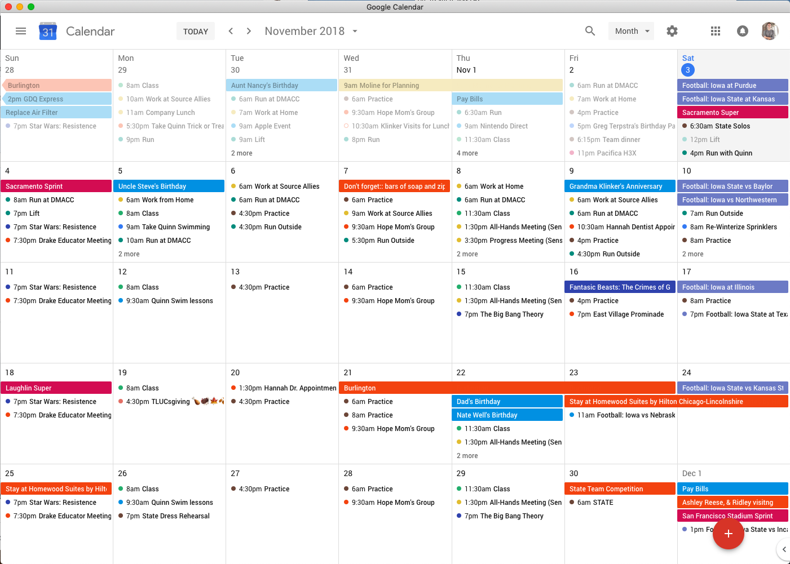

# Google Calendar - Desktop



Having my calendar in the dock helps remind me to check it. This is just a simple web wrapper for Google Calendar.

## Build Instructions

1. Install Electron and project dependencies:

```
$ npm install -g electron
$ yarn install
```

2. Run the app:

```
$ yarn start
```

The app will only run if you have shut down any other instances. If you use `npm start` while another instance is running, it will simply display the window of that old instance, instead of starting the app.

## Packaging Information

To package the apps for each platform:

```
$ yarn
$ yarn run build-mac
$ yarn run build-linux
$ yarn run build-windows
```

### Notes on Building for Mac

With MacOS Catalina (`10.14.5`), Apple requires DMG files to be notarized by the distributer. The files that I distribute are all signed and notarized by me.

If you are looking to develop the app yourself, you can debug and run the app through `yarn start` without issue. However, if you want to make a signed executable (`yarn build-mac`), you will need to set up your Apple ID and password for the notarization process.

To do this, you will first need a valid Apple developer account. You can sign up at https://developer.apple.com. You will need to use Xcode to [export your new developer signing information](https://help.apple.com/xcode/mac/current/#/dev154b28f09) and add it to your keychain.

You will then need to generate an app-specific password for that Apple ID. This is not the same as the password that you use to sign in to your developer account. You can create this app-specific password, here: https://appleid.apple.com

After completing those two steps, create a `.env` file in the root of this project. It should look something like:

```
APPLEID=test@someemail.com
APPLEIDPASS=xxxx-tttt-vvvv-aaaa
```

## License

    Copyright 2018 Luke Klinker

    Licensed under the Apache License, Version 2.0 (the "License");
    you may not use this file except in compliance with the License.
    You may obtain a copy of the License at

       http://www.apache.org/licenses/LICENSE-2.0

    Unless required by applicable law or agreed to in writing, software
    distributed under the License is distributed on an "AS IS" BASIS,
    WITHOUT WARRANTIES OR CONDITIONS OF ANY KIND, either express or implied.
    See the License for the specific language governing permissions and
    limitations under the License.
